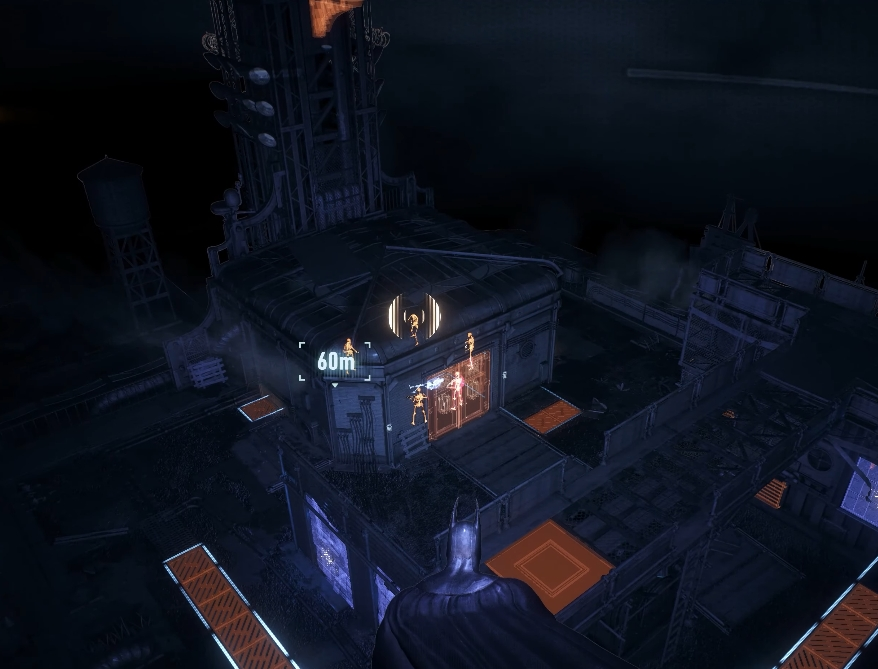
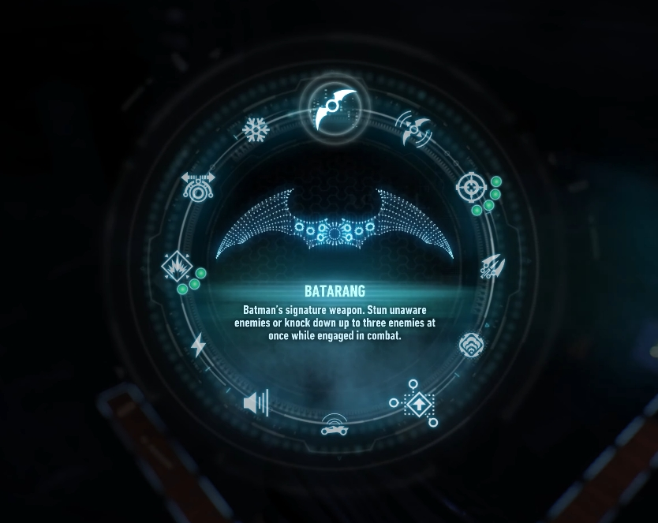
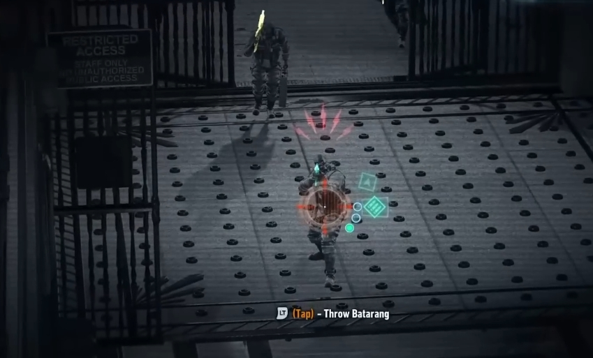
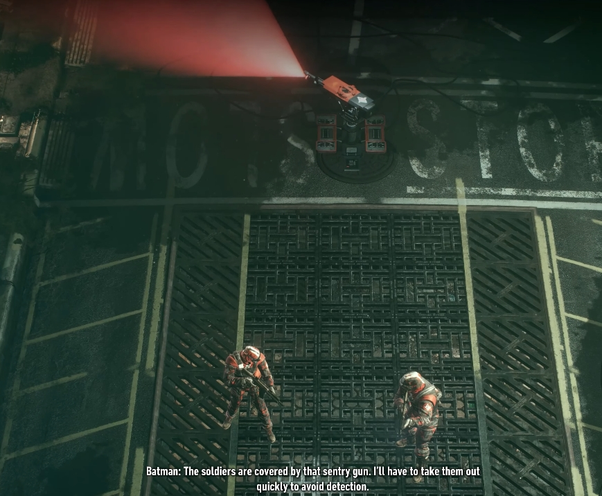

# 🦇 Batman: Arkham Series

## Design Focus

Stealth-driven level design with flexible transitions between stealth and combat.

---

## Core Mechanics

The Arkham series emphasizes predator-style stealth gameplay, supported by highly vertical level design.
Environments include vantage points, ground-level cover, tunnels, and multi-layered spaces, each paired with distinct stealth actions and takedowns.

*Vantage point, ceiling access, sewer gate and destructable items are all highlighted in detective mode.*[^1]

[^1]: Image source: BATMAN-ARKHAM.com

Detective mode and a large variaty of gadgets offered ease the level difficulty and encourage different types of stealth tactics. 

*Bat gadgets selection bar in game.*[^1]

---

## Design Strengths

The level design supports stealth at multiple spatial layers, encouraging players to read and manipulate enemy positioning.

Grapling gun and gliding allow quick position changes to remain out of sight, and agility to deal with complicated situations.

Importantly, stealth failure does not immediately force combat; instead, the game offers transitional mechanics that preserve player agency.

When detected, players are given quick decisions—such as slow-motion aiming and smoke grenades then attacking or grapling away—that allow recovery rather than immediate failure.

*Player spotted when stealth take down an enemy.*[^1]

Continuing high-quality free-flow close-combat style guarantee the fun even after stealth failure. 

Enemy AI dynamically adapts to player tactics too, gradually countering frequently used gadgets or approaches, which prevents repetitive optimal strategies. AI also dramatically reacts to the detection of player actions, allowing player to see the effect of fear and to enhance the feeling of success. 

*AI protected by sentry gun to limit player's movement.*[^1]

---

## Design Insights

The Arkham series shows that forgiving stealth systems can encourage experimentation.

By allowing recovery after mistakes and enabling smooth stealth–combat transitions, the game reduces frustration while maintaining tension, which is why it is considered one of the best stealth-action game for non-hard-core players.

Adaptive enemy behavior further reinforces long-term engagement and tactical variety, encouraging audacious and aesthetic stealth gaming recordings shared between players.
