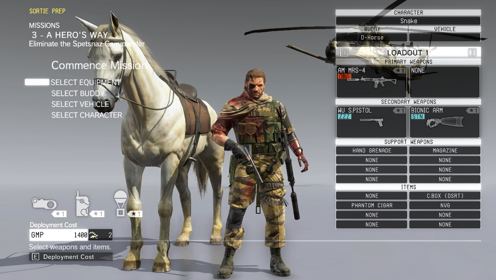
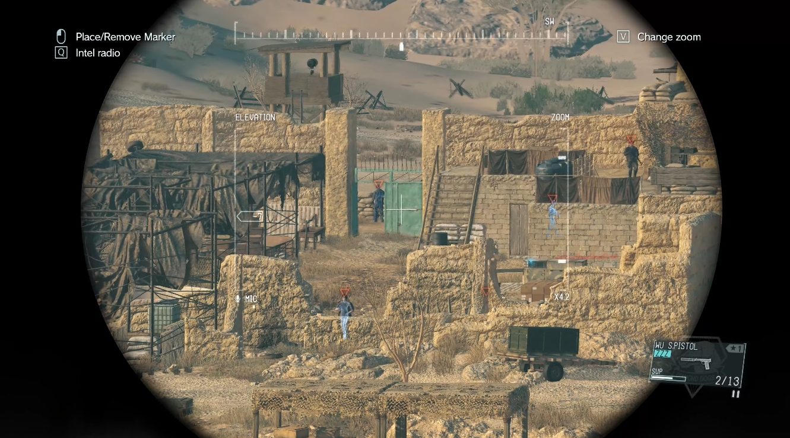
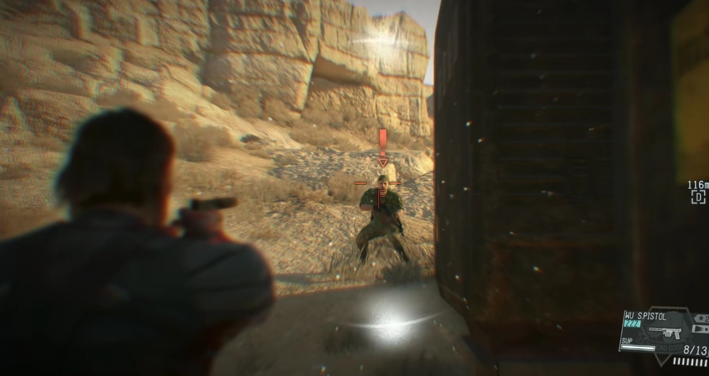

# Metal Gear Solid V: The Phantom Pain

## Design Focus
Systemic integration of stealth and combat in an open-ended sandbox.

MGSV treats stealth and combat not as mutually exclusive modes,
but as two ends of a continuous spectrum shaped by player choice and systemic feedback.

---

## Core Mechanics

MGSV places strong emphasis on mission preparation.
Before deployment, players select companions, equipment, insertion methods, and loadouts,
establishing intent and constraints before gameplay begins.

*Mission preparation interface before deployment.*

During missions, players are given access to a wide range of tools,
including lethal and non-lethal weapons, environmental interactions,
and deliberately playful distraction items.
These tools support multiple playstyles without explicitly labeling any as optimal.

Information acquisition is deliberately fragmented.
Only minimal intel is provided before deployment,
requiring players to actively gather information through binocular scouting,
enemy interrogation, and support from the intelligence team.
Critical details are also embedded subtly in mission descriptions and environmental storytelling,
reinforcing uncertainty as a core part of the experience.

*Reconnaissance through binocular scouting.*

This design frames each mission as an information problem as much as a combat encounter.

---

## Design Strengths

One of MGSV’s strongest design achievements is its **reactive enemy ecosystem**.
Enemy behavior is readable and grounded in player intuition:
guards signal alerts with flashlights, surrender when threatened from behind,
and communicate via radio when detecting suspicious activity.

These immediate reactions provide clear, diegetic feedback,
allowing players to understand detection states without relying on abstract UI.

The mission sandbox functions as a persistent war zone.
Enemy patrol patterns shift over time based on mission context and player actions,
preventing encounters from becoming static or fully solvable through memorization.

More importantly, enemy AI operates within a long-term adaptation system.
Repeated player behaviors lead to meaningful systemic responses,
such as increased helmet usage after frequent headshots
or expanded night-vision equipment following repeated night missions.[^1]

[^1]: Detailed mechanics are documented on the MGSV Wiki: https://metalgear.fandom.com/wiki/Revenge_System_(enemy_preparedness)

*Enemy equipment adapts in response to repeated headshots.*  
([Image source](https://steamcommunity.com/sharedfiles/filedetails/?id=1285241667))

Classic CQC mechanics provide reliable close-range control,
allowing stealth encounters to degrade naturally into combat rather than collapse into failure.
Because gunplay is mechanically solid, forced combat remains engaging instead of punitive.

MGSV further incentivizes non-lethal play through the Fulton recovery system.
Captured enemies and resources directly contribute to base development,
unlocking higher-tier equipment and support options.

*Recovered personnel can be reassigned to different base departments.*

This creates a feedback loop where tactical restraint is mechanically rewarded,
linking moment-to-moment decisions with long-term progression.

---

## Stealth–Combat Transition Design

MGSV excels at handling stealth failure.
Detection rarely represents a binary success–failure state,
but instead marks a transition point where player options shift.

Players may choose to:
- Recover stealth through repositioning or non-lethal takedowns
- Escalate into open combat
- Blend both approaches dynamically

This design preserves tension while avoiding frustration,
encouraging improvisation rather than strict optimization.

*Reflex Mode briefly slows time when the player is spotted.*

---

## Design Insights

MGSV demonstrates how **systemic AI adaptation** can reinforce player identity.
By responding to player habits rather than scripted triggers,
the game allows players to feel ownership over their chosen playstyle.

More broadly, MGSV shows that strong stealth–combat integration
relies less on perfect execution and more on **forgiving transitions**,
clear feedback, and long-term systemic consequences.

These principles are especially valuable in open-world contexts,
where player behavior is unpredictable and design robustness is essential.

---

## Design Extension: What I Would Explore Further

If I were to extend MGSV’s design, I would further develop how enemy adaptation
is communicated to the player.

While enemy behavior changes meaningfully over time,
feedback is often implicit rather than explicit.
Introducing clearer in-world cues — such as overheard radio chatter,
visual changes in patrol formations, or post-mission debrief summaries —
could help players better understand the cause-and-effect relationship
between their actions and enemy responses.

Additionally, I would explore expanding non-lethal and stealth-focused counters
to enemy adaptation, ensuring that escalation does not disproportionately
favor lethal combat solutions.

These extensions would aim to preserve MGSV’s systemic depth
while improving readability and player learning without reducing freedom.
