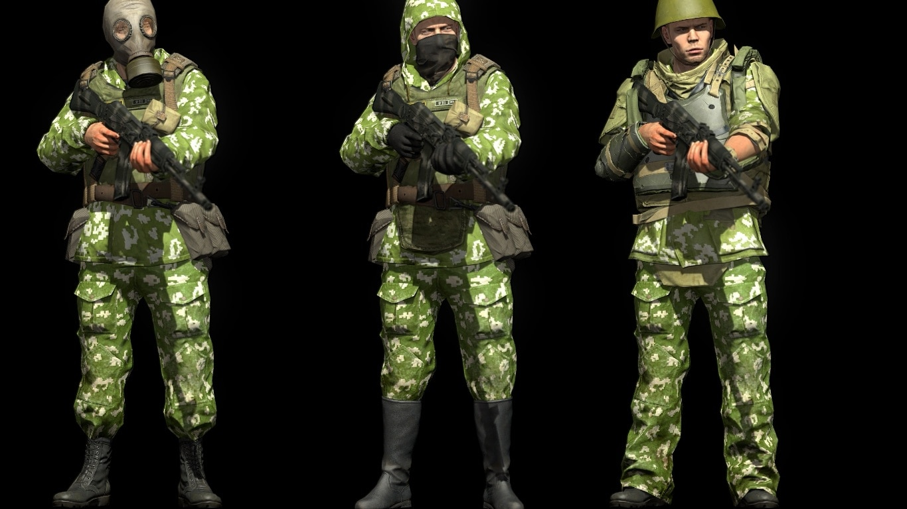

# Metal Gear Solid V: The Phantom Pain

## Design Focus
Systemic integration of stealth and combat in an open-ended sandbox.

MGSV treats stealth and combat not as mutually exclusive modes,
but as two ends of a continuous spectrum shaped by player choice and systemic feedback.

---

## Core Mechanics

MGSV places strong emphasis on mission preparation.
Before deployment, players select companions, equipment, insertion methods, and loadouts,
establishing intent even before gameplay begins.

During missions, players are given access to a wide range of tools,
including lethal weapons, non-lethal options, environmental interactions,
and deliberately humorous distraction items.
These tools support multiple playstyles without explicitly labeling any as optimal.

Enemy AI operates within a persistent revenge system.
Over time, enemies adapt their equipment and behavior based on observed player tendencies,
such as increased helmet usage in response to frequent headshots.[^1]

[^1]: Detailed mechanics are documented on the MGSV Wiki: https://metalgear.fandom.com/wiki/Revenge_System_(enemy_preparedness)

*As enemies adapt to repeated headshots, equipment changes reinforce long-term consequences.*

---

## Design Strengths

One of MGSV’s strongest design achievements is its **reactive enemy ecosystem**.
Enemy adaptation creates a sense of long-term consequence,
transforming repeated player behavior into meaningful world responses.

Classic CQC mechanics provide reliable close-range control,
allowing stealth encounters to degrade naturally into combat rather than collapse into failure.
Because gunplay is mechanically solid, forced combat remains engaging instead of punitive.

Mission preparation sequences — including buddy selection and deployment animations —
reinforce player agency and emotional investment before each operation,
strengthening the link between planning and execution.

---

## Stealth–Combat Transition Design

MGSV excels at handling stealth failure.
Detection does not represent a binary success–failure state,
but rather a transition point where player options shift.

Players can choose to:
- Recover stealth through repositioning or distraction
- Escalate into open combat
- Blend both approaches dynamically

This design preserves tension while avoiding frustration,
encouraging improvisation rather than strict optimization.

---

## Design Insights

MGSV demonstrates how **systemic AI adaptation** can reinforce player identity.
By responding to player habits rather than scripted triggers,
the game allows players to feel ownership over their playstyle.

More broadly, MGSV shows that strong stealth–combat integration
relies less on perfect execution and more on **forgiving transitions**,
clear feedback, and long-term systemic consequences.

These principles are especially valuable in open-world contexts,
where player behavior is unpredictable and design robustness is essential.

---

## Design Extension: What I Would Explore Further

If I were to extend MGSV’s design, I would further develop how enemy adaptation
is communicated to the player.

While enemy behavior changes meaningfully over time,
feedback is often implicit rather than explicit.
Introducing clearer in-world cues — such as overheard radio chatter,
visual changes in patrol formations, or post-mission debrief summaries —
could help players better understand the cause-and-effect relationship
between their actions and enemy responses.

Additionally, I would explore expanding non-lethal and stealth-focused counters
to enemy adaptation, ensuring that escalation does not disproportionately
favor lethal combat solutions.

These extensions would aim to preserve MGSV’s systemic depth
while improving readability and player learning without reducing freedom.
