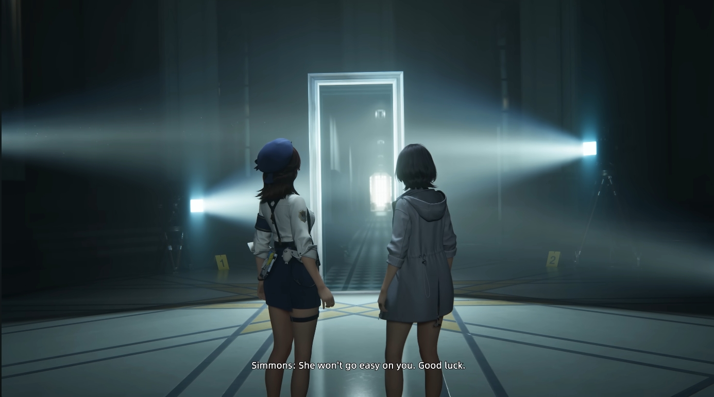
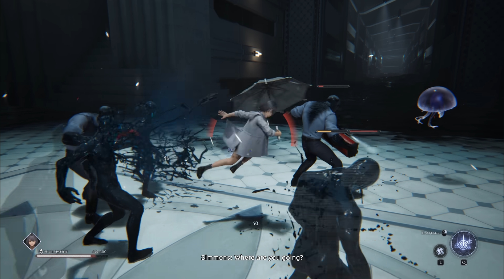
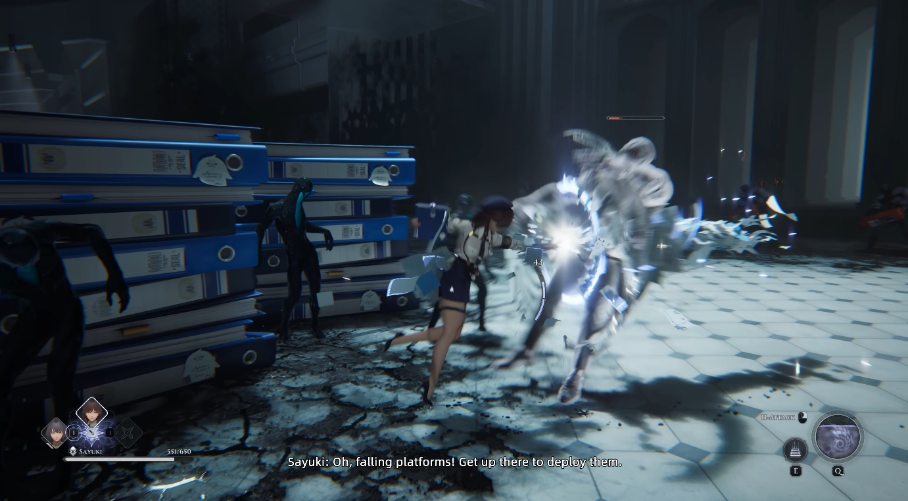
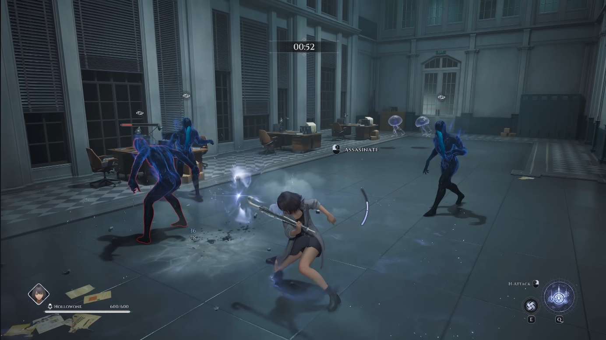
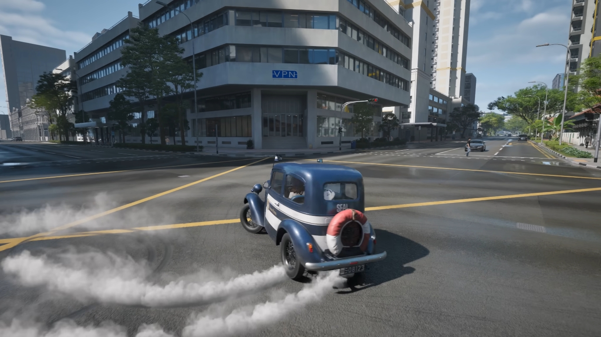
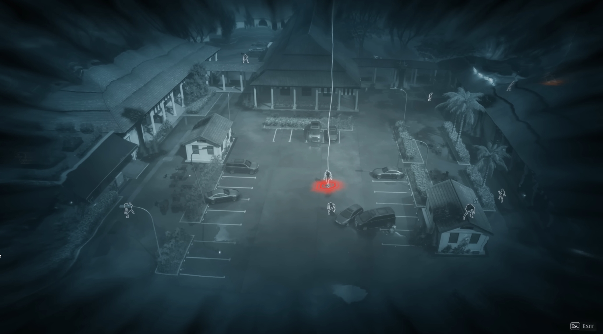
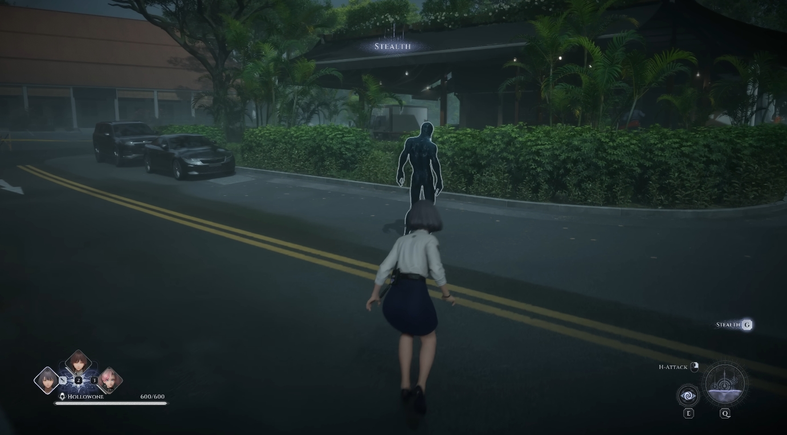
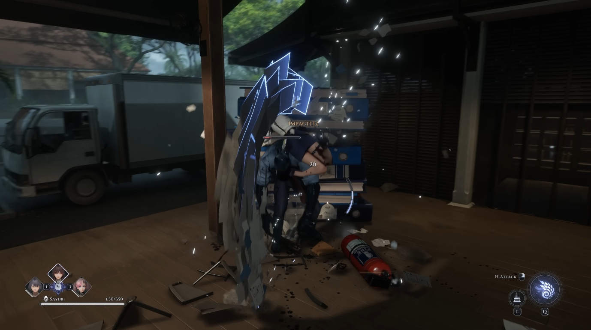
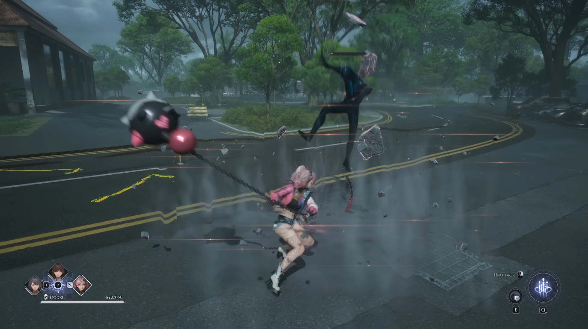

# 👮‍♀️ Varsapura – Speculative Combat Design Notes

## Context

These notes are based on the publicly released 31-minute gameplay demo of *Varsapura*.
They are intended as a speculative design exploration rather than a critique or assessment of the final game.

The observations below focus specifically on combat, stealth, and system integration
within an urban open-world context.

---

## Observed Design Signals

From the gameplay showcase, *Varsapura* appears to combine:
- A dense urban open world
- A 3-character-swapping, team-based combat system
- Light stealth encounters embedded within traversal and mission flow
- A visual style emphasizing readability through strong lighting and environmental contrast

*Strong lighting and color contrast support readability in dense urban scenes.*

These elements suggest a design goal of maintaining fast-paced action
while preserving clarity in a visually complex environment,
especially under frequent character switching.

---

## Design Challenges (Speculative)

Integrating team-based combat into an urban open world introduces several potential challenges:

- **Combat Readability**  
  Dense environments and verticality can obscure enemy intent, attack timing,
  and threat prioritization, especially during character switching.

  

  *Multiple simultaneous threats place high demand on visual and audio feedback.*

  This raises questions about how threat signaling and damage feedback scale
  when several characters and abilities are active at once.

- **Spatial Awareness**  
  Urban layouts increase the likelihood of off-screen threats,
  making audio cues and environmental indicators critical for player decision-making.

  

  *Environmental objects block sightlines while shaping enemy movement.*

  Such layouts suggest a reliance on indirect feedback rather than direct line-of-sight awareness.

- **Stealth–Combat Transitions**  
  Light stealth segments raise questions about how detection states escalate
  and whether failure leads to meaningful tactical shifts rather than abrupt mode changes.

  

  *Assassination prompts appearing after combat begins suggest flexible state boundaries.*

  This implies a potential design direction where stealth actions remain viable
  even after partial detection.

- **Mission Transportation Design**  
  Vehicle traversal appears to be a primary method of connecting mission locations,
  raising questions about how transportation systems might integrate with combat preparation
  rather than serving purely as movement.

  

  *Vehicle usage may provide opportunities for pre-combat setup or environmental interaction.*

These challenges are common in open-world action games,
but become more pronounced when layered with fast character swapping and live-service systems.

---

## Design Directions I Am Interested In

From a combat design perspective, I am particularly interested in exploring:

- How players are given time and tools to prepare for upcoming encounters,
  especially in a live-service gacha context where players often maintain multiple teams
  for different mission types

  

  *Overhead views may support planning and spatial understanding before engagement.*

- How stealth failure can transition into combat in a way that feels intentional,
  allowing players to recover, reposition, or escalate dynamically

  

  *Stealth indicators suggest graded detection states rather than binary failure.*

- How enemy behavior and feedback can remain readable
  when multiple player characters and abilities are active simultaneously

  

  *Clear damage-type indicators support moment-to-moment combat readability.*

- How systemic enemy responses might support player experimentation
  without disproportionately punishing preferred playstyles

  

  *Crowd-control effects highlight opportunities for expressive ability usage.*

- How character-switching mechanics could enrich stealth gameplay,
  particularly if stealth actions are shared or sequenced across characters

These directions align closely with my broader interest in
forgiving transitions, readable feedback loops, and robust systemic design.

---

## Scope & Disclaimer

This page reflects personal design thinking based solely on publicly available footage.
It is not intended as design feedback or a proposal for changes,
but rather as an example of how I approach analyzing emerging combat systems
during early development stages.
